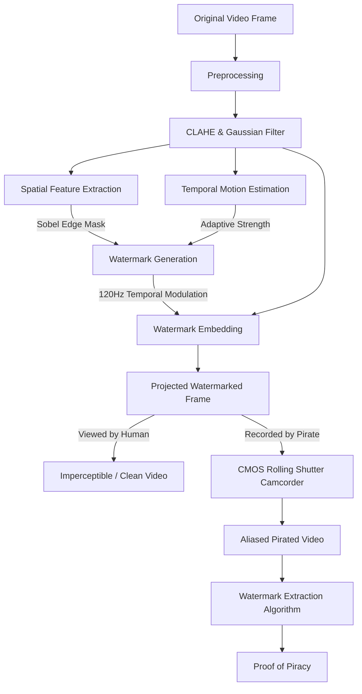

# Adaptive Temporal-Spatial Modulation (ATSM) Framework

> **A robust computational imaging framework designed to deter digital video piracy through invisible high-frequency watermarking and rolling-shutter exploitation.**

This repository contains the complete implementation of the ATSM framework for research and evaluation. It is designed to embed an imperceptible, high-frequency temporal watermark into a digital cinema projection. When a pirate attempts to record the screen using a smartphone or consumer camcorder (which utilize CMOS rolling shutter sensors), the watermark severely aliases with the camera's scanning rate, creating visible horizontal distortion bands. This distortion acts as both a deterrent and a forensic proof of piracy.

---

## 🏗️ System Architecture

The framework processes video streams continuously without overwhelming system RAM. It dynamically calculates the structural and temporal properties of the video to perfectly hide the watermark from legitimate viewers.



---

## ⚡ CPU vs. GPU Acceleration

This repository provides two complete processing pipelines to suit your hardware:

1. **`main.py` (CPU Version):** Uses standard OpenCV and NumPy. Best for local testing or machines without dedicated graphics cards.
2. **`main_gpu.py` (GPU Version):** Uses **PyTorch** to drastically accelerate mathematical convolutions (Sobel gradients) and matrix additions by pushing the arrays to NVIDIA VRAM. This can process sequences of 10,000+ frames **10x faster** on a T4 GPU.

---

## ⚙️ Environment Setup

### Option 1: Google Colab (Recommended for Research)
For the fastest setup, open the included `setup_colab.ipynb` notebook in Google Colab.
1. Enable the T4 GPU (`Runtime` > `Change runtime type` > `T4 GPU`).
2. Run the notebook. It will securely prompt you for your Kaggle API Token (`KGAT_...`), download the 8GB dataset directly to Google's cloud servers, and run the PyTorch framework automatically!

### Option 2: Local Installation
If running locally, ensure you have Python 3.8+ installed.
```bash
git clone https://github.com/rajarajanponraj/ATSM_Framework.git
cd ATSM_Framework
pip install -r requirements.txt
```

---

## 🚀 Execution Guide

The framework's data loader is completely agnostic. You can feed it directories of images or standard video files!

### 1. Using the DAVIS-240C Research Dataset
If you are replicating the paper's results, download the [DAVIS-240C Event Camera Dataset](https://www.kaggle.com/datasets/gogo827jz/davis-240c-datasets) via Kaggle. Unzip a specific sequence (e.g., `shapes_6dof/`) to prevent RAM overload.

```bash
# Run with GPU acceleration
python main_gpu.py --dataset path/to/dataset/shapes_6dof/
```

### 2. Using a Custom Video (.mp4 / .avi)
You can test the framework on your own custom video files instantly. Just point the `--dataset` argument to your movie file.

```bash
# Run on a custom MP4 movie
python main_gpu.py --dataset my_movie.mp4
```

---

## 📊 Outputs & Research Metrics

When the framework finishes processing the video, it automatically generates the metrics required for quantitative analysis:

1. **Console Output:** Prints the final averages for **MSE, PSNR, SSIM, Bit Error Rate (BER), and Extraction Accuracy**.
2. **Performance Graph:** Automatically saves a high-resolution `atsm_metrics_graph.png` showing how Accuracy, PSNR, SSIM, and BER fluctuated over the course of the video.
3. **Visual Proof Generation:** At exactly **Frame 50**, the framework saves 5 critical images to your directory for your research paper figures:
   - `proof_1_original.png`: The raw movie frame.
   - `proof_2_spatial_mask.png`: The Sobel gradient map dictating where the watermark is hidden.
   - `proof_3_watermarked.png`: The imperceptible frame projected in the cinema.
   - `proof_4_camcorder_exaggerated.png`: The pirate's recording, featuring heavily exaggerated rolling shutter banding.
   - `proof_5_extracted_exaggerated.png`: The final isolated watermark extracted from the pirated footage as forensic proof.
